# Treinamento - Engenharia de Dados Com Pentaho Data Integration

Workshop prático de **40 minutos** demonstrando, na prática, como construir um pipeline de Engenharia de Dados usando **Pentaho Data
Integration**, integrando múltiplas fontes de dados (MySQL, MariaDB e Excel) em um **Data Warehouse PostgreSQL**.

Este projeto simula um cenário real de integração de dados corporativos, como ocorre em ambientes hospitalares, financeiros e industriais.

## 1. Objetivo

Demonstrar: 
- Conceitos de ETL vs ELT


- Arquitetura típica de um pipeline de dados
- Extração de dados de múltiplas fontes
- Transformação e padronização
- Carga em um Data Warehouse

## 2. Arquitetura

```mermaid 
flowchart LR

A["MySQL (Fornecedor 1 - Sistema de Gestão de Pessoas)"]
B["MariaDB (Fornecedor 2 - Sistema de Vendas)"]
C["Excel (Categorias dos Vendedores - Feito pela gestão)"]

D["Pentaho Data Integration"]
E["PostgreSQL (DW - Data Warehouse)"]

A --> D
B --> D
C --> D
D --> E
```



## 3. Preparando o Ambiente
### 3.1. Postgresql (Nosso DW)
```docker run --name RHP_DW -p 5437:5432 -e POSTGRES_USER=rhp -e POSTGRES_PASSWORD=rhp1010 -e POSTGRES_DB=rhp_dw -d postgres:16.0```<br>
*documentação: https://hub.docker.com/_/postgres*

### 3.2. Mysql (Fornecedor 1 - Sistema de Gestão de Pessoas)
```docker run --name DB_FORNECEDOR_1 -p 3306:3306 -e MYSQL_USER=rhp -e MYSQL_PASSWORD=fornecedor1 -e MYSQL_DATABASE=rhp_dados_funcionarios -e MYSQL_RANDOM_ROOT_PASSWORD=yes -d mysql:9.5.0```<br>
***para conectar, modifique: allowPublicKeyRetrieval=TRUE***<br>
*documentação: https://hub.docker.com/_/mysql*

#### Criando e Inserindo Dados na Tabela "funcionarios"
```
CREATE TABLE funcionarios (
    id INT PRIMARY KEY,
    funcionario VARCHAR(100) NOT NULL,
    documento VARCHAR(20) NOT NULL
);
```
```
INSERT INTO funcionarios (id, funcionario, documento) VALUES
(1, 'Bruce Wayne', '100.244.845-11'),
(2, 'Oswald Cobblepot', '200.541.784-01'),
(3, 'Dick Grayson', '024.447.845-35'),
(4, 'Selina Kyle', '317.999.411-42'),
(5, 'Bane Dorrance', '080.144.889-58'),
(6, 'Arthur Fleck', '600.777.968-62'),
(7, 'Edward Nigma', '701.141.977-95');
```
### 3.3. MariaDB (Fornecedor 2 - Sistema de Vendas)
```docker run --detach --name DB_FORNECEDOR_2 -p 3307:3306 -e MARIADB_USER=rhp -e MARIADB_PASSWORD=fornecedor2 -e MARIADB_DATABASE=rhp_dados_vendas -e MARIADB_ROOT_PASSWORD=my-secret-pw mariadb:latest```<br>
*documentação: https://hub.docker.com/_/mariadb*
#### Criando e Inserindo Dados na Tabela "vendas"
```
CREATE TABLE vendas (
    cpf VARCHAR(20) NOT NULL,
    dt_mes DATE NOT NULL,
    total_vendas DECIMAL(15,2) NOT NULL,
    PRIMARY KEY (cpf, dt_mes)
);
```
```
INSERT INTO vendas (cpf, dt_mes, total_vendas) VALUES
('100.244.845-11','2025-01-01',128450.75),
('100.244.845-11','2025-02-01',121980.20),
('100.244.845-11','2025-03-01',134210.10),
('100.244.845-11','2025-04-01',139885.60),
('100.244.845-11','2025-05-01',145320.90),
('100.244.845-11','2025-06-01',141110.35),
('100.244.845-11','2025-07-01',150990.40),
('100.244.845-11','2025-08-01',148220.80),
('100.244.845-11','2025-09-01',155430.15),
('100.244.845-11','2025-10-01',162775.55),
('100.244.845-11','2025-11-01',158990.25),
('100.244.845-11','2025-12-01',171340.90),

('200.541.784-01','2025-01-01',84210.30),
('200.541.784-01','2025-02-01',79950.10),
('200.541.784-01','2025-03-01',86540.80),
('200.541.784-01','2025-04-01',90320.45),
('200.541.784-01','2025-05-01',92775.60),
('200.541.784-01','2025-06-01',88910.20),
('200.541.784-01','2025-07-01',95110.70),
('200.541.784-01','2025-08-01',93340.00),
('200.541.784-01','2025-09-01',97225.35),
('200.541.784-01','2025-10-01',101880.90),
('200.541.784-01','2025-11-01',98810.60),
('200.541.784-01','2025-12-01',107450.10),

('024.447.845-35','2025-01-01',65440.90),
('024.447.845-35','2025-02-01',62310.25),
('024.447.845-35','2025-03-01',68155.70),
('024.447.845-35','2025-04-01',70990.10),
('024.447.845-35','2025-05-01',73220.45),
('024.447.845-35','2025-06-01',70110.80),
('024.447.845-35','2025-07-01',75880.15),
('024.447.845-35','2025-08-01',74125.60),
('024.447.845-35','2025-09-01',77610.95),
('024.447.845-35','2025-10-01',81245.30),
('024.447.845-35','2025-11-01',79550.20),
('024.447.845-35','2025-12-01',84670.75),

('317.999.411-42','2025-01-01',112330.40),
('317.999.411-42','2025-02-01',108950.90),
('317.999.411-42','2025-03-01',116780.25),
('317.999.411-42','2025-04-01',120440.10),
('317.999.411-42','2025-05-01',124990.80),
('317.999.411-42','2025-06-01',121220.35),
('317.999.411-42','2025-07-01',127880.60),
('317.999.411-42','2025-08-01',126510.15),
('317.999.411-42','2025-09-01',131995.45),
('317.999.411-42','2025-10-01',137240.90),
('317.999.411-42','2025-11-01',134110.30),
('317.999.411-42','2025-12-01',143880.55),

('080.144.889-58','2025-01-01',95510.20),
('080.144.889-58','2025-02-01',91770.60),
('080.144.889-58','2025-03-01',98225.90),
('080.144.889-58','2025-04-01',101330.40),
('080.144.889-58','2025-05-01',104880.75),
('080.144.889-58','2025-06-01',100120.10),
('080.144.889-58','2025-07-01',106990.55),
('080.144.889-58','2025-08-01',105440.30),
('080.144.889-58','2025-09-01',109775.80),
('080.144.889-58','2025-10-01',114990.25),
('080.144.889-58','2025-11-01',112330.60),
('080.144.889-58','2025-12-01',121550.90),

('600.777.968-62','2025-01-01',43110.75),
('600.777.968-62','2025-02-01',40890.20),
('600.777.968-62','2025-03-01',45220.95),
('600.777.968-62','2025-04-01',46990.40),
('600.777.968-62','2025-05-01',48810.60),
('600.777.968-62','2025-06-01',46240.10),
('600.777.968-62','2025-07-01',50110.35),
('600.777.968-62','2025-08-01',49330.80),
('600.777.968-62','2025-09-01',51890.25),
('600.777.968-62','2025-10-01',54120.90),
('600.777.968-62','2025-11-01',52990.10),
('600.777.968-62','2025-12-01',57840.55),

('701.141.977-95','2025-01-01',73550.10),
('701.141.977-95','2025-02-01',70210.45),
('701.141.977-95','2025-03-01',76180.80),
('701.141.977-95','2025-04-01',78890.25),
('701.141.977-95','2025-05-01',81240.60),
('701.141.977-95','2025-06-01',77610.15),
('701.141.977-95','2025-07-01',83490.90),
('701.141.977-95','2025-08-01',82110.30),
('701.141.977-95','2025-09-01',85670.75),
('701.141.977-95','2025-10-01',89240.20),
('701.141.977-95','2025-11-01',87410.55),
('701.141.977-95','2025-12-01',94380.90);
```
### 3.4. Excel (Categorias dos Vendedores - Feito pela gestão)
Tabela atualizada pela gestão: ````data\equipes.xlsx````
### 3.5. Pentaho
Instruções de instalação:
- Baixe o Pentaho 🔗 [pdi-ce-9.4.0.0-343](https://github.com/ambientelivre/legacy-pentaho-ce/releases/download/pdi-ce-9.4.0.0-343/pdi-ce-9.4.0.0-343.zip) e extraia em C:
- Baixe e instale o [java 8](https://www.java.com/pt-br/download/manual.jsp)
- Crie a variável JAVA_HOME apontando para o diretório de instalação do java 8:
```C:\Program Files\Java\jre1.8.0_481```
- Copie o conector ``jar_files\mysql-connector-j-9.6.0.jar`` e cole na pasta ```C:\data-integration\lib```

### 4. Criação do Pipeline

- Faça a conexão dos 3 bancos no pentaho (*use o conector MySQL para fechar a conexão com o banco MariaDB*)
- Crie uma única tabela que retorne a competência, o nome do funcionário, a equipe e o valor total em vendas

### 5. Projeto Final
<br><br>
- Fluxo Final: 
---
Marclyson Rodrigues<br>
Engenheiro de Dados | Power BI | Oracle | Pentaho<br>
🔗 https://github.com/Marclyson